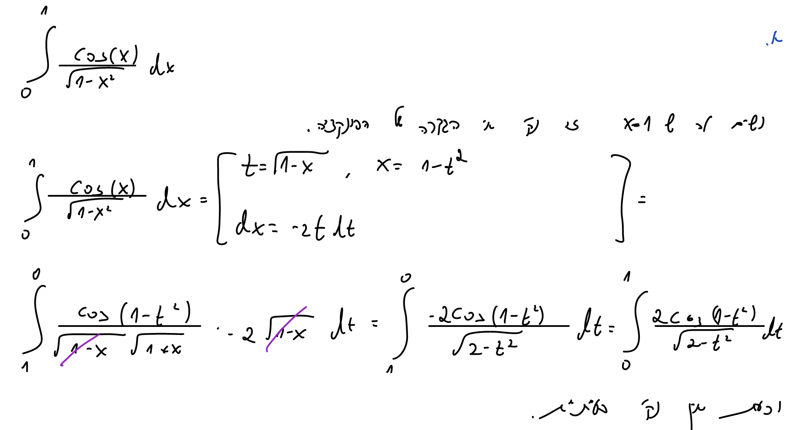
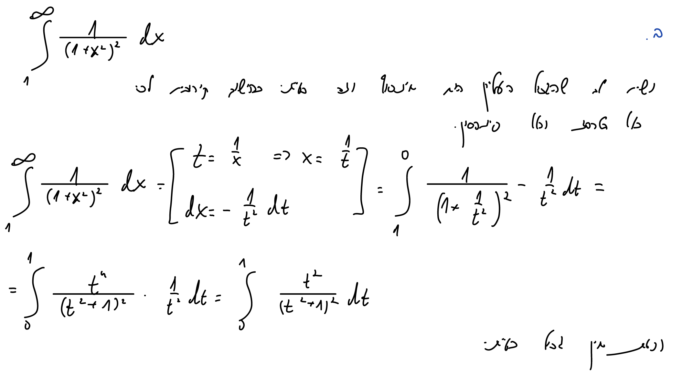
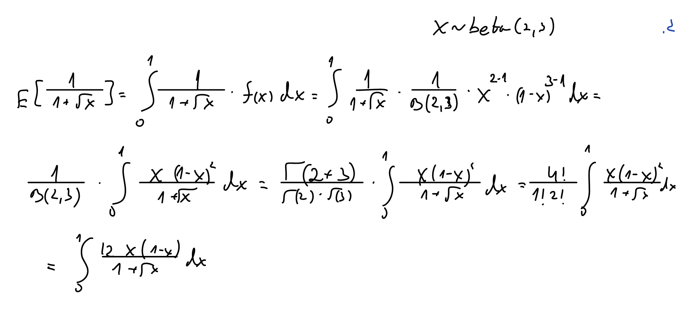
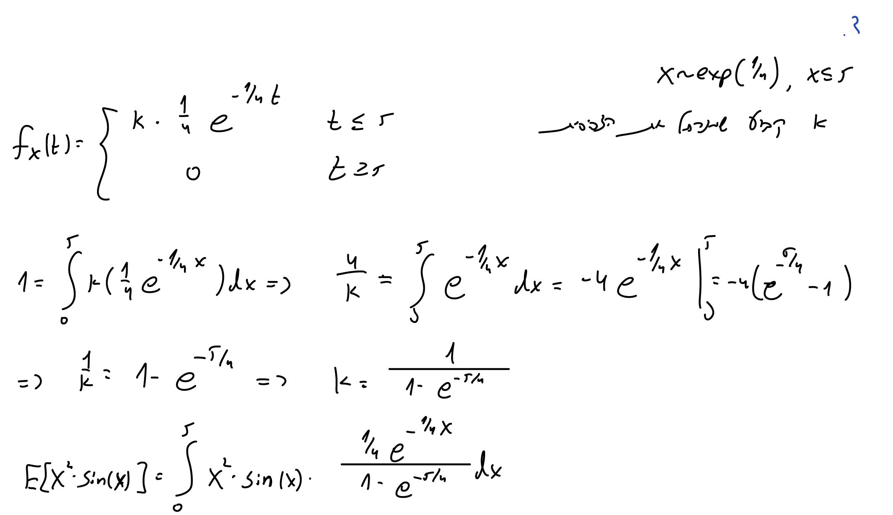
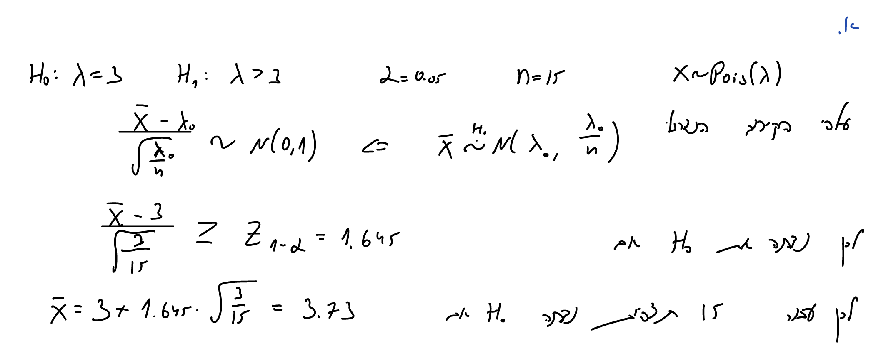
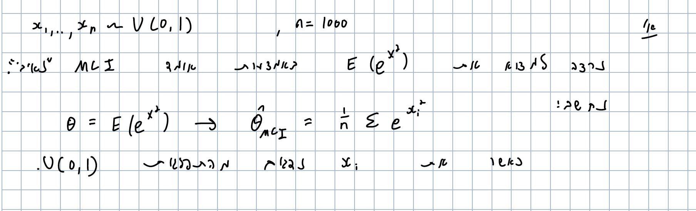
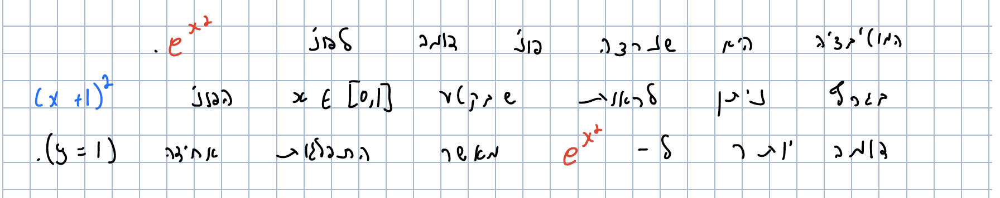
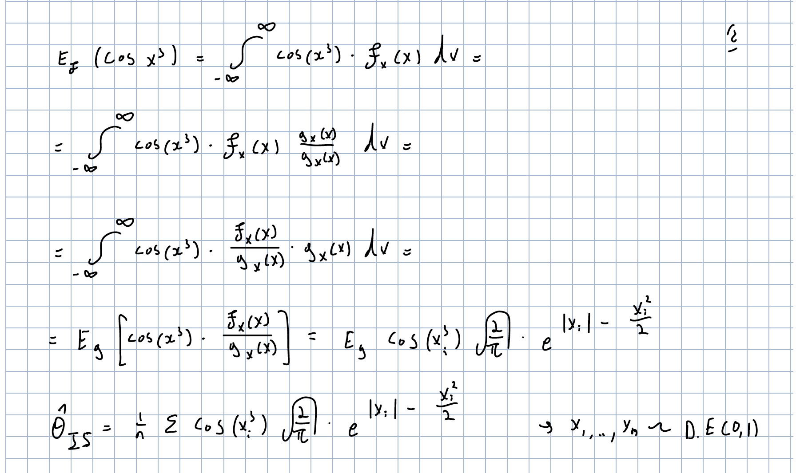
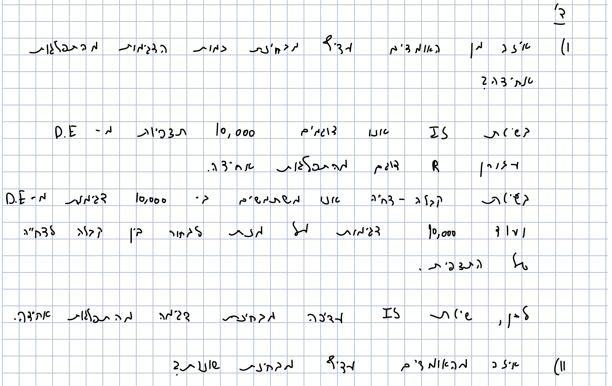

# Q.1

#### Trapezoid Rule Function

```{r}
trapezoid_rule <- function(func,up.limit,low.limit,n){
  point <- seq(from = low.limit, to = up.limit, by = ((up.limit - low.limit)/(n-1)))
  s = 0
  for(i in c(1:(n-1))){
    s = s + func(point[i]) + func(point[i+1])
  }
  s = (0.5*(up.limit - low.limit)/(n-1))*s
  print(c("Our Trapezoid estimation is",s),quote = FALSE)
}
```

#### Simpson Rule Function

```{r}
simpson_rule <- function(func,up.limit,low.limit,n){
  point <- seq(from = low.limit, to = up.limit, by = ((up.limit - low.limit)/(n-1)))
  s = 0
  for(i in c(1:(n-1))){
    s = s + func(point[i]) + 4*func((point[i]+point[i+1])/2) +  func(point[i+1])
  }
  s = ((up.limit - low.limit)/((n-1)*6))*s
  print(c("Our Simpson estimation is",s),quote = FALSE)
}
```

#### Monte Carlo & CI Function

```{r}
monte_carlo_integration_and_CI <- function(func,up.limit,low.limit,n){
  U <- runif(n = n,min = low.limit ,max = up.limit)
  s = func(U)
  theta = (up.limit - low.limit) * mean(s)
  sd = sqrt((1/n)*var(s))
  u_ci = theta + qnorm(0.975) * sd
  l_ci = theta - qnorm(0.975) * sd
  print(c("Our MCI estimation is",theta),quote = FALSE)
  print(c("Our CI is",l_ci , u_ci),quote = FALSE)
}
```

## a

### a.1

```{r, echo=FALSE}

```

```{r}
f.a.1 <- function(x)
{
  y <-  (2*cos(1-(x^2)))/(sqrt(2-(x^2)))
  return(y)
}

trapezoid_rule(func = f.a.1,up.limit = 1,low.limit = 0,n = 10000)
simpson_rule(func = f.a.1,up.limit = 1,low.limit = 0,n = 10001)
```

We can see that both method gave us same result.

```{r}
monte_carlo_integration_and_CI(func = f.a.1,up.limit = 1,low.limit = 0,n = 10000)
```

### a.2

```{r, echo=FALSE}

```

```{r}
f.a.2 <- function(x)
{
  y <-  (x^2/(1+x^2)^2)
  return(y)
}

trapezoid_rule(func = f.a.2,up.limit = 1,low.limit = 0,n = 10000)
simpson_rule(func = f.a.2,up.limit = 1,low.limit = 0,n = 10001)
```

We can see that both method gave us same result.

```{r}
monte_carlo_integration_and_CI(func = f.a.2,up.limit = 1,low.limit = 0,n = 10000)
```

### a.3

```{r, echo=FALSE}

```

```{r}
f.a.3 <- function(x)
{
  y <-  (12*x*(1-x)^2)/(1+sqrt(x))
  return(y)
}

trapezoid_rule(func = f.a.3,up.limit = 1,low.limit = 0,n = 10000)
simpson_rule(func = f.a.3,up.limit = 1,low.limit = 0,n = 10001)
```

We can see that both method gave us same result.

```{r}
monte_carlo_integration_and_CI(func = f.a.3,up.limit = 1,low.limit = 0,n = 10000)
```

### a.4

```{r, echo=FALSE}

```

```{r}
f.a.4 <- function(x)
{
  y <-  ((x^2) * (sin(x)) * (0.25*exp(-0.25*x)) / (1 - exp(-1.25)))
  return(y)
}

trapezoid_rule(func = f.a.4,up.limit = 5,low.limit = 0,n = 10000)
simpson_rule(func = f.a.4,up.limit = 5,low.limit = 0,n = 10001)
```

We can see that both method gave us same result.

```{r}
monte_carlo_integration_and_CI(func = f.a.4,up.limit = 5,low.limit = 0,n = 10000)
```

# Q.2

## a

```{r, echo=FALSE}

```

## b

```{r}
f.2.b <- function(lambda,n){
  x <- rpois(n = n, lambda = lambda)
  return(((mean(x)-lambda)/sqrt(lambda/n)) > 1.645)
}

result.2.b <- replicate(n = 5000, f.2.b(lambda = 3, n = 15))
alpha_hat.2.monte_carlo <- mean(result.2.b)
sd.2.monte_carlo <- sqrt((1/5000)*var(result.2.b))
CI.2.monte_carlo <- c(alpha_hat.2.monte_carlo-qnorm(0.975)*sd.2.monte_carlo,alpha_hat.2.monte_carlo+qnorm(0.975)*sd.2.monte_carlo)
```


```{r, echo=FALSE}
print(c("Our Monte Carlo estimation for alpha is",alpha_hat.2.monte_carlo),quote = FALSE)
print(c("Our CI is",CI.2.monte_carlo),quote = FALSE)

```

## c

```{r}
f.2.c<- function(lambda,n,known_lambda){
  x <- rpois(n = n, lambda = known_lambda) # importance sampling - pois(lambda from a)
  m <- mean(x) >= known_lambda # if lambda = 3 it is relatively rare
  f <- function(x){return(dpois(x, lambda = lambda))} # our target
  g <- function(x){return(dpois(x, lambda = known_lambda))} # our importance sampling
  our_vec <- numeric(n)
  for(i in 1:n){
    our_vec[i] <- f(x[i])/g(x[i])
  }
  return(m*prod(our_vec))
}

result.2.c <- replicate(n = 5000, f.2.c(lambda = 3, n = 15 ,known_lambda = 3.73))
alpha_hat.2.importance_sampling <- mean(result.2.c)
sd.2.importance_sampling <- sqrt((1/5000)*var(result.2.c))
CI.2.importance_sampling <- c(alpha_hat.2.importance_sampling-qnorm(0.975)*sd.2.importance_sampling,alpha_hat.2.importance_sampling+qnorm(0.975)*sd.2.importance_sampling)
```


```{r, echo=FALSE}
print(c("Our Importance Sampling estimation for alpha is",alpha_hat.2.importance_sampling),quote = FALSE)
print(c("Our CI is",CI.2.importance_sampling),quote = FALSE)
```

## d

```{r}
sd.2.monte_carlo
sd.2.importance_sampling
```

We may see that the variance of Monte Carlo estimator is larger than the Importance Sampling estimator. Therefore, we would prefer the Importance Sampling estimator.

# Q.3 

## a

```{r, echo=FALSE}

```

```{r}
set.seed(123)
X <- runif(n = 1000,min = 0,max = 1)
g.MCI.x <- exp(X^2)
theta_MCI <- mean(g.MCI.x)
```


```{r, echo=FALSE}
print(c("Our MCI estimation for E(e^x^2) is",theta_MCI),quote = FALSE)
```

## b

```{r, echo=FALSE}
knitr::include_graphics(c("3.b.1.png","3.b.2.png"))
```

```{r}
set.seed(123)
u.vec <- runif(n = 1000,min = 0,max = 1)
X <- (7*u.vec+1)^(1/3) - 1
g.IS.x <- 7*exp(X^2) / (3*((X+1)^2))
theta_IS <- mean(g.IS.x)
```


```{r, echo=FALSE}
print(c("Our IS estimation for E(e^x^2) is",theta_IS),quote = FALSE)
```


```{r, echo=FALSE}

```

```{r}
x.dots <- seq(from = 0, to = 1, by = 0.01)
original_func <- exp(x.dots^2)
g_func <- (x.dots+1)^2

plot(x.dots,original_func,ylim = c(0,4), col = "red", xlab = "x (0<x<1)", ylab = "y(x) (for 3 functions)")
points(x.dots,g_func, col = "blue")
points(x.dots,rep(1,101), col = "black")
legend(0, 4, legend=c("exp(x^2)", "(x+1)^2","uniform (0,1)"), col=c("red", "blue","black"), lty = 1 ,cex=0.8)
```

## c


```{r,, echo=FALSE}
print(c("The variance theta_MCI is",var(g.MCI.x)/1000),quote = FALSE)
print(c("The variance theta_IS is",var(g.IS.x)/1000),quote = FALSE)
```

We may see that the variance of Monte Caelo Integration estimator is larger than the Importance Sampling estimator. Therefore, we would prefer the Importance Sampling estimator

# Q.4

## a

```{r,, echo=FALSE}
#install.packages("extraDistr")
library(extraDistr)
```

```{r}
dbl.exp.sample <- rlaplace(n = 10000,mu = 0,sigma = 1)
```

## b

```{r, echo=FALSE}
knitr::include_graphics(c("4.b.1.png","4.b.2.png"))
```

```{r}
c.Q4 <- sqrt(2/pi) * exp(0.5)
norm.sample <- numeric(0)

for (i in 1:10000) {
  u.Q4.i <- runif(n = 1,min = 0,max = 1)
  f.x.i <- dnorm(x = dbl.exp.sample[i],mean = 0,sd = 1)
  g.x.i <- dlaplace(x = dbl.exp.sample[i],mu = 0,sigma = 1)
  
  if ((f.x.i/(g.x.i*c.Q4)) >= u.Q4.i) {
    norm.sample <- c(norm.sample,dbl.exp.sample[i])
  }
}
```

```{r}
plot(density(norm.sample), main = "our norm sample density (using accept-reject method)") #check we got normal distribution
Q4.b.data <- cos(norm.sample^3)
```


```{r, echo=FALSE}
print(c("Estimation for E(cos(x^3)), x~N(0,1) is",mean(Q4.b.data)),quote = FALSE)
```

## c

```{r, echo=FALSE}

```

```{r}
Q4.c.data <- cos(dbl.exp.sample^3) * sqrt(2/pi) * exp(-0.5*(dbl.exp.sample^2) + abs(dbl.exp.sample))
```


```{r, echo=FALSE}
print(c("Estimation for E(cos(x^3)), x~N(0,1), using IS method is",mean(Q4.c.data)),quote = FALSE)
```

## d

```{r, echo=FALSE}

```

```{r, echo=FALSE}
print(c("The variance theta acc-rej is",var(Q4.b.data)/length(Q4.b.data)),quote = FALSE)
print(c("The variance theta_IS is",var(Q4.c.data)/10000),quote = FALSE)
```

We may see that the variance of acc-rej estimator is larger than the Importance Sampling estimator. In this case, sample size is a crucial factor (because in the acc-rej we got much less observations and  the division by n/m had great influence). Therefore, we would prefer the Importance Sampling estimator.


